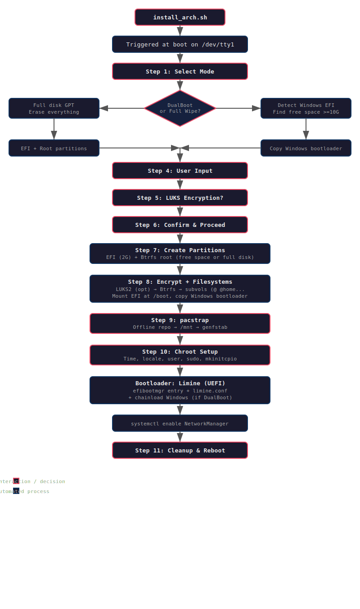

# Arch Offline Installer / DualBoot ISO

This project builds a custom Arch Linux ISO that can install Arch fully offline, with or without a DualBoot setup alongside Windows.

## `build_iso.sh`

Builds the ISO. It:

1. Installs `archiso` if missing, then copies the `releng` profile as a base.
2. Downloads all packages and their dependencies into an **offline repo** (`/var/cache/offline-repo`).
3. Embeds `install_arch.sh` into the ISO so it runs automatically at boot on `tty1`.
4. Creates two `pacman.conf` variants:
   - **online** — for the ISO live environment.
   - **offline** — points at the bundled repo (`file:///var/cache/offline-repo/`), used by the installer.
5. Writes ISO metadata (`arch-offline-installer`, label `ARCH_OFFLINE`).
6. Runs `mkarchiso` and copies the resulting `.iso` to the project directory.

## `install_arch.sh`

Automated installer that runs when booting the ISO. Steps:

1. **Mode selection** — DualBoot (alongside an existing OS) or Full Wipe (erases the disk).
2. **Disk selection** — Lists available disks, excludes the boot medium.
3. **Windows detection** — Finds the Windows EFI partition for chainloading.
4. **Free space detection** (DualBoot) — Finds the largest free region (min 10 GiB).
5. **User input** — Hostname, username, password.
6. **Encryption** — Optional LUKS2 root encryption.
7. **Partitioning** — EFI (2 GiB, FAT32) + Btrfs root in free space or full disk.
8. **Filesystems** — Btrfs with subvolumes (`@`, `@home`, `@snapshots`, `@log`), mounts EFI at `/boot`, copies Windows bootloader for chainloading.
9. **Installation** — `pacstrap` from the **offline repo** when available, else online.
10. **Chroot configuration** — Timezone, locale, hostname, user creation, sudo, mkinitcpio (btrfs + encrypt hooks), **Limine** bootloader, zram-generator, NetworkManager.
11. **Cleanup** — Offers to reboot.

### Bootloader

Uses **Limine** (UEFI). DualBoot adds a chainload entry for Windows.

### Offline repo

The ISO carries a full package cache so the installation can run without internet.

## Installation Flow

